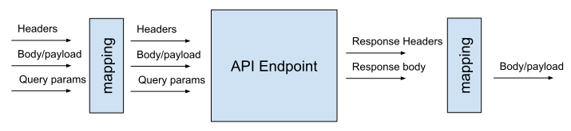

# API Request

When creating an API request, we first start by defining the point-to-point connection to the API endpoint of interest. This includes the following:

### URL

the url which is made of:
https://en.wikipedia.org/wiki/URL#Syntax
* host
* path

### Request method:
https://en.wikipedia.org/wiki/Hypertext_Transfer_Protocol#Request_methods

### Parameters:

* name of the parameter: if the parameter is nested, we refer to it with dots representing the different levels of nesting (e.g. `{"country": {"name": "xx"}}` becomes `country.name`)
* type: data type of the parameter see https://en.wikipedia.org/wiki/JSON#Data_types_and_syntax
* optional: whether optional or not. Is it required by the API endpoint or not
* parameter location: the parameter can be given either through: 
  * body/payload
  * header
  * query params
* I/O: whether the parameter is an expected input or output

#### Default value

a default value can be assigned with the parameter. This happens when comparing the values received by the user and the ones expectedc by the API endpoint.

#### Parameter mapping

sometimes it is useful to override the definition of the parameter with a different name and/or parameter location.
For instance, the API definition expects `myParam` as a query parameter (i.e. `?myParam=myValue`) and we would like to pass the parameter in the payload. Hence we change override the location of the parameter.

Notes on URL:
https://www.mattcutts.com/blog/seo-glossary-url-definitions/
https://url.spec.whatwg.org/#url-apis-elsewhere

